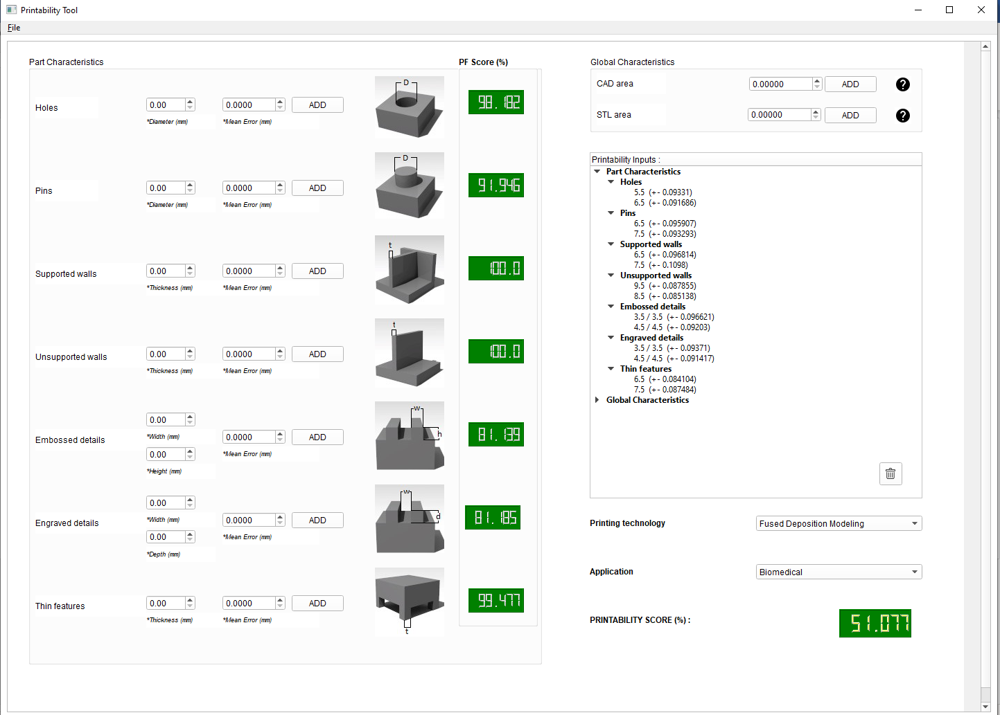

# PrintabilityTool
## _A user-friendly interactive tool that determines the printability score._

The tool calculates the part characteristic score (PF) for a part to be printed without failure and the final printability score.

-	The user specifies the dimensions of the critical geometric features of a mesh.
-	The user specifies (optionally) a prediction for the dimensional error.
-	The system supports many instances for each part characteristic category.
-	All data are displayed in a tree structure from where the user can interactively remove any of them.  
-	The tool can store a specific configuration given by the user as a .json file. 
-	There is a warning when the probability for successful printing is less than 50%.



## Reference

ArxivX link

## Dependencies 

- Windows 10
- Python 3.6 or later
- Numpy
- PyQT5

## Run Printability Computation tool

```sh
python PrintabilityTool.py
```

## How to use it

- **Give inputs:**

Set critical dimension and dimensional error, then press ‘Add’ button next to them. 

-	**Select technology and application:**

Technologies: Fused Deposit Modeling, Material jetting or Binder jetting.

Applications: Biomedical, Mechanical or Artistic. 

-	**Delete one input:**

Right click on this input at the tree structure. Press ‘Delete’.

-	**Delete all inputs:**

Press the trash button.

-	**Save profile:**

Press file button then press ‘Save profile’. It saves all inputs in a .json file.

-	**Load profile:**

Press file button then press ‘Load profile’. It loads all inputs from a .json file.


# Printability Computation source code

## printabilityComputation.py


- **_computePrintability_** (data, technology, application)


| Args |  |
| ------ | ------ |
| Dictionary data | Refers to CAD’s dimensions for each design characteristic. Data must be a Python dictionary with a specific format. |
| Int technology | Defines the 3d printing technology among three: 0 (FDM), 1 (Material jetting) or 2 (Binder jetting). |
| Int application |  Specifies the use case of the model: 0 (Biomedical), 1 (Mechanical) or 2 (Artistic). |

| Returns |  |
| ------ | ------ |
| Float  output	| % Pintability Score |


- **_computePFperChar_** (data, technology, application)


| Args |  |
| ------ | ------ |
| Dictionary data | Refers to CAD’s dimensions for each design characteristic. Data must be a Python dictionary with a specific format. |
| Int technology | Defines the 3d printing technology among three: 0 (FDM), 1 (Material jetting) or 2 (Binder jetting). |
| Int application | Specifies the use case of the model: 0 (Biomedical), 1 (Mechanical) or 2 (Artistic). |

| Returns |  |
| ------ | ------ |
| Float  output	| % Part Characteristic Score (PF_score) |


- **_globalPrintability_** (data,technology,application)


| Args |  |
| ------ | ------ |
| Dictionary data | Refers to CAD’s dimensions for each design characteristic. Data must be a Python dictionary with a specific format. |
| Int technology | Defines the 3d printing technology among three: 0 (FDM), 1 (Material jetting) or 2 (Binder jetting). |
| Int application | Specifies the use case of the model: 0 (Biomedical), 1 (Mechanical) or 2 (Artistic). |

| Returns |  |
| ------ | ------ |
| Float  output	| Global Probability (PG) |


- **_partCharacteristicPrintability_** (data, technology, application)


| Args |  |
| ------ | ------ |
| Dictionary data | Refers to CAD’s dimensions for each design characteristic. Data must be a Python dictionary with a specific format. |
| Int technology | Defines the 3d printing technology among three: 0 (FDM), 1 (Material jetting) or 2 (Binder jetting). |
| Int application |  Specifies the use case of the model: 0 (Biomedical), 1 (Mechanical) or 2 (Artistic). |

| Returns |  |
| ------ | ------ |
| Float  output	| Part Characteristic Probability (PF) |

